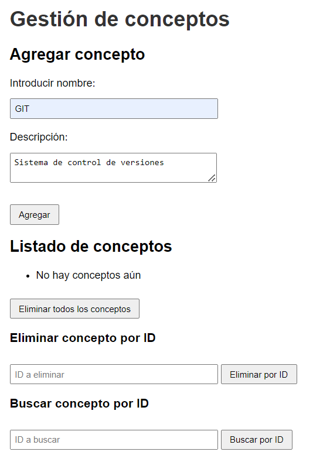
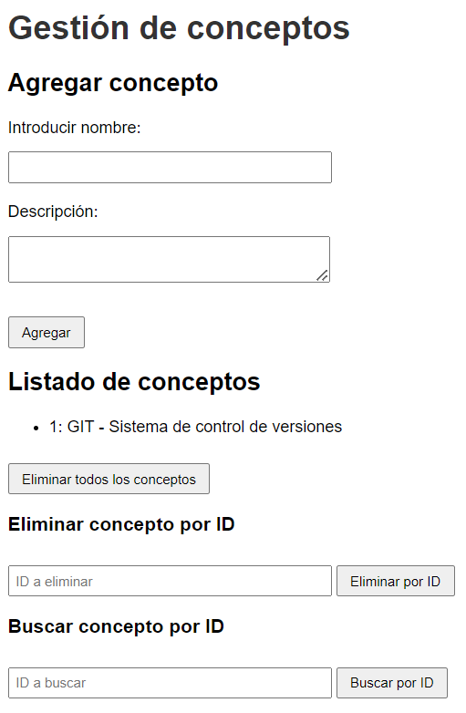
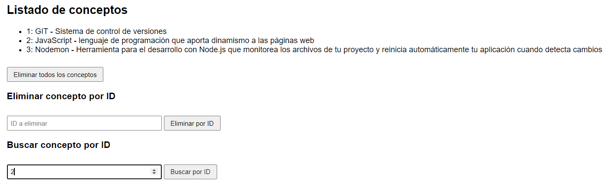
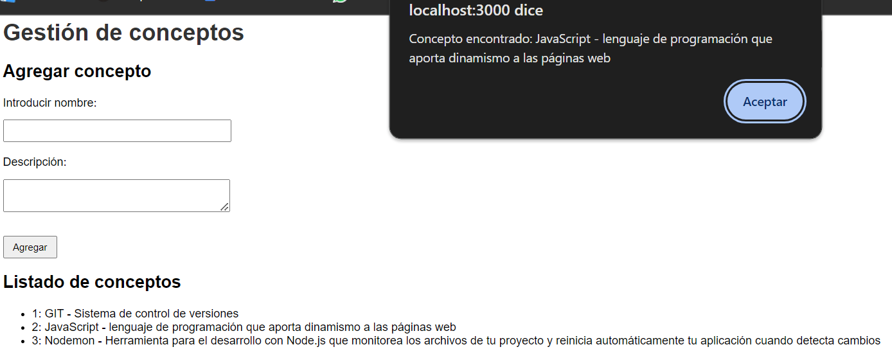
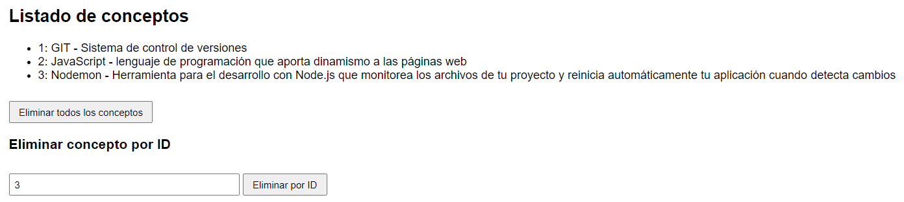
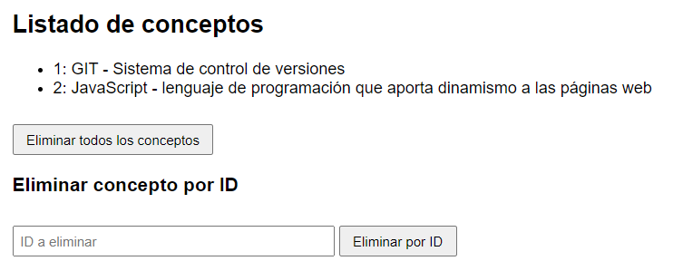
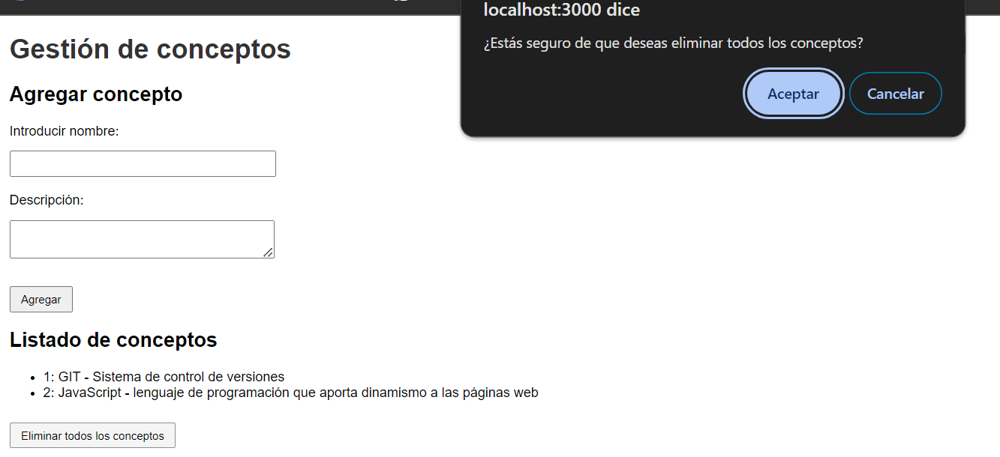
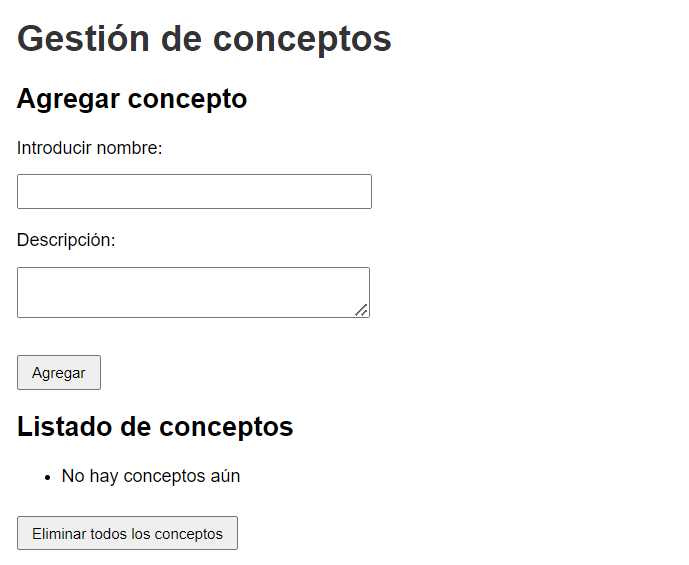

Casos de prueba realizados:
1) Al ingresar el concepto y la descripción, debajo debe aparecer el concepto.

Al tocar Agregar:

2) Por cada vez que agreguemos, se va actualizando la lista. Por lo tanto el buscar por ID, va a agilizar la busqueda de los conceptos

Al ingresar un ID y tocamos Buscar por ID nos sale una alerta con el concepto con el ID correspondiente:

3) Al querer eliminar, hay 2 formas, eliminar todo o eliminar por ID

3) 1) Eliminar por ID
 

Al ingrear un ID y tocamos Eliminar por ID, nos va a salir un cartel de alerta confirmando la operación y elimina el concepto

3) 2) Eliminar todo

Al tocar el botón Eliminar todos los conceptos nos sale una advertencia para confirmar eliminar todo

y luego los elimina 

-----------------------------------------------------------------------------------

Conclusiones:
1) Eliminar por ID

El problema que tuve con esto, que creo que es lo que me llevó mas tiempo de todo, fue elimar por id. Para obtener el ID por url estaba haciendo lo que vimos en clase que fue el:

const id = parseInt(pathname.slice(21));

Realmente no se porque exactamente me rompía ahí, pero entre todas las busquedas que hice la IA me recomendó usar lo siguiente:

const partes = pathname.split('/');
const id = parseInt(partes[partes.length - 1]);

Me dio esta opción ya que con esta forma, divide cada elemento de la url cada vez que hay un "/" y toma el ultimo, que en este caso va a ser el que contenga el id, sin importar cuantos elementos tenga la ruta.

2) GIT

Si bien creo que le pude agarrar la mano, al principio me mareaba bastante el hecho de saber si estaba en el remoto o en el local y el miedo que si en cada subida ""perdiera"" cosas. Porque si bien el cuatrimestre pasado usamos GIT, lo usaba muy mal. Por ejemplo, por cada actualización de codigo que haciamos, al momento de subirlo creabamos una rama exclusivamanete para esa versión y nunca habíamos realizado un merge. Por lo tanto haberlo visto ahora me aclaró mucho mas como es su correcta utilización y siento que me llevo un buen aprendizaje de una herramienta que se utiliza en el merado actual.

3) JavaScript 

Esto ya es algo personal pero es un lenguaje que se me hace dificil entenderlo, al ver la sintaxis se me hace poco amigable y tengo que estar constantemente buscando en internet o con una IA al lado para tratarla. Pero también es la primera vez que lo vemos bastante a fondo y creo que también es normal y uno de los desafíos de aprender un nuevo lenguaje.